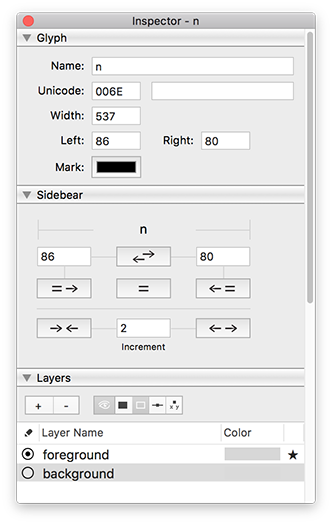

# Sidebear

 
Robofont extension for manipulating sidebearings. Sidebear installs itself in your Inspector, underneath the `GlyphInfoPane`.
 
 

## Actions include:
`Swap sidebearings`
 
`Make LSB = RSB`
 
`Center glyph` Make SBs equal (Set width may change +/- 1)
 
`Make RSB = LSB`

##### Choose an increment, then:
`Expand both sidebearings` equally by that increment.
 
`Contract both sidebearings` equally by that increment.
   

ʕ·ᴥ· ʔ
 
Enjoy designing with your friendly Sidebear   
 

